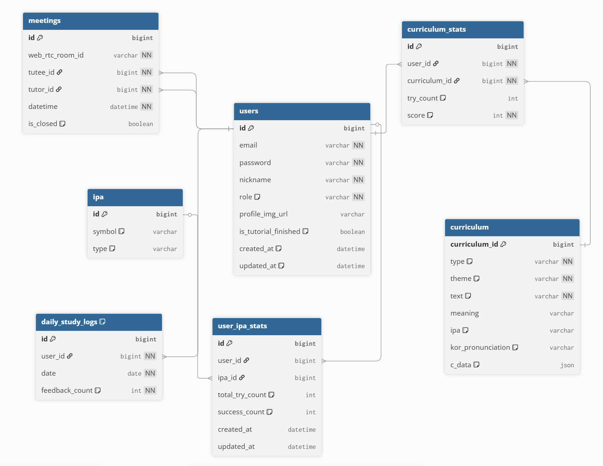

# 🎙️ 바르미 (Barmi) Backend

**바르미(Barmi)** 는 AI 기반 발음 분석 기술과 실시간 WebRTC 코칭을 결합한 청각장애인을 위한 영어 발음 학습 플랫폼입니다.  

본 레포지토리는 **AI서버와 사용자 사이를 잇는 '지능형 오케스트레이터'** 로서의 백엔드 구현에 집중했습니다.

---

## 🔥 AI 최적화 및 핵심 문제 해결
- **[AI 파이프라인 최적화] RabbitMQ를 통한 GPU 서버 지연 시간 격리**
  - **문제**: AI 엔진의 비결정적 연산 지연으로 인해 API 응답이 늦어지거나 서버 가용성이 저하되는 문제가 있었습니다.
  - **해결**: 고부하 분석 작업을 RabbitMQ 기반 비동기 메시징 시스템으로 분리하여, 사용자에게는 즉시 `taskId`를 반환하고 백그라운드에서 분석을 처리함으로써 가용성을 확보했습니다.

- **[지능형 데이터 합성] LLM 기반 개인화 학습 맥락 오케스트레이션**
  - **문제**: 파편화된 AI 분석 수치만으로는 청각장애 사용자에게 실질적인 학습 동기를 부여하기 어려운 한계가 있었습니다.
  - **해결**: 자바 백엔드가 오케스트레이터가 되어 사용자의 과거 IPA 성취도와 실시간 결과를 결합한 동적 LLM 프롬프트를 조율함으로써, 맥락 있는 맞춤형 피드백을 생성했습니다.

- **[고속 분석 리포팅] 하이브리드 캐싱을 통한 AI 결과 서빙 속도 향상**
  - **문제**: 대규모 AI 분석 로그와 누적 학습 데이터를 조회할 때 DB I/O 병목으로 응답 속도가 저하되는 이슈가 있었습니다.
  - **해결**: Caffeine Cache와 JPA Fetch Join을 전략적으로 조합하여 반복 조회 부하를 메모리 계층에서 처리하고, N+1 문제를 원천 차단하여 밀리초(ms) 단위의 성능을 확보했습니다.

- **[실시간 코칭 안정성] OpenVidu 서버 사이드 제어를 통한 보안 화상 세션 관리**
  - **문제**: 브라우저 기반 WebRTC 환경에서 무단 접속 위협과 불안정한 세션 종료로 인한 사용자 경험 저하를 해결해야 했습니다.
  - **해결**: 서버 사이드 API를 통해 보안 토큰을 동적으로 할당하고 세션 상태를 중앙 관리함으로써, 비정상 종료 시에도 안정적인 재접속을 지원하는 신뢰성 있는 인프라를 구축했습니다.

---

## 🏗 시스템 아키텍쳐

시스템의 전체적인 흐름과 백엔드 내부의 상세 계층 구조를 시각화한 구조도입니다.

### 1. 백엔드 전체 아키텍쳐
스프링 부트 백엔드의 주요 기술적 역할과 외부 시스템 간의 데이터 오케스트레이션 흐름입니다.


---

### 2. 백엔드 세부 아키텍쳐
백엔드 내부의 각 도메인 영역별 상세 계층 구조와 기술적 설계 방식입니다.

#### 2-1. 보안계층 (V1)
사용자 인증 및 API 진입점에 대한 보안 계층 구조입니다.


#### 2-2. 도메인 로직 (V2)
Caffeine 캐시를 활용한 비즈니스 로직 최적화 및 영속성 계층 흐름입니다.


#### 2-3. AI 비동기 요청 (V3)
RabbitMQ와 비동기 처리를 활용한 AI 연동 엔진 아키텍처입니다.


---

### 3. Database ERD
시스템의 데이터 모델링 구조입니다.


---

## 🎯 Backend Focus: 사용자 경험을 위한 기술적 아키텍처

단순히 기능적으로 동작하는 것을 넘어, **청각장애 사용자의 학습 몰입을 방해하는 지연 시간과 데이터 파편화 문제**를 기술적으로 해결하는 데 집중했습니다.

### 1. 지연 없는 학습 환경
- **비동기 메시징 기반 작업 처리**: 연산 부하가 큰 AI 분석을 **RabbitMQ**를 통한 비동기 작업으로 분리했습니다. 이를 통해 서버 스루풋(Throughput)을 최적화하고 사용자에게 즉각적인 인터랙션을 보장합니다.
- **실시간 데이터 통합**: 파편화되어 전달되는 AI 엔진의 분석 결과(발음, 억양, 피드백 등)를 백엔드에서 논리적으로 통합하여, 사용자에게 완성된 형태의 리포트를 전달합니다.

### 2. 지능형 데이터 오케스트레이션
- **맥락 기반 피드백 생성**: 수치화된 AI 분석 데이터를 그대로 노출하지 않고, DB에 적재된 사용자의 누적 학습 데이터와 결합합니다. 이를 통해 **LLM(Large Language Model)**이 개인화된 인사이트를 제공하도록 조율합니다.
- **도메인 중심 설계(DDD)**: 복잡한 비즈니스 로직을 도메인별로 분리하여 코드의 유지보수성과 확장성을 높였으며, 각 도메인 간의 독립성을 확보했습니다.

### 3. 고속 데이터 접근 및 성능 최적화
- **다계층 캐싱 전략**: 빈번하게 접근하는 개인 학습 진척도는 **Caffeine Cache**를 활용해 인메모리에서 즉시 처리하며, DB I/O 부하를 획기적으로 줄였습니다.
- **데이터베이스 튜닝**: 대규모 데이터 조회 시 발생하는 **N+1 문제**를 원천 차단하는 최적화된 Join 쿼리와 인덱스 전략을 통해 응답 시간을 최소화했습니다.

---

## 🛠 Tech Stack

- **Framework**: Spring Boot 3.4.1 (Java 17)
- **Messaging**: RabbitMQ (AI 분석 요청 및 결과 수신 비동기화)
- **Caching**: Caffeine Cache (반복 조회 데이터 인메모리 처리)
- **Real-time**: OpenVidu (WebRTC 기반 화상 세션 및 보안 인프라 관리)
- **Database**: MySQL 8.0 & Spring Data JPA
- **Infra**: Docker & Docker Compose (환경 격리 및 네트워크 가용성 확보)

---

## 📂 Domain Directory Guide

```text
backend/src/main/java/com/example/backend/
├── domain/            # 🚀 Core Business Domains
│   ├── ai/            # AI 성적 분석 결과 및 GMS/OpenAI 프록시 연동
│   ├── conversation/  # 실시간 대화 스크립트 및 세션 정보 관리
│   ├── curriculum/    # 학습 콘텐츠 (단어, 문장) 리소스 관리
│   ├── meeting/       # 튜터-학생 화상 미팅 및 OpenVidu 연동 로직
│   ├── report/        # 학습 통계 집계 및 LLM 기반 맞춤형 성적 피드백 생성
│   └── user/          # 유저 식별 정보, 프로필 및 온보딩 관리
└── global/            # 🌐 Global Infrastructure
```

---

## ⚙️ Project Setup & Configuration

### Environment Variables (.env)
보안을 위해 실제 자격 증명은 환경 변수로 관리해야 합니다. 아래 형식을 참고하여 설정을 진행하세요.

```bash
# Database Settings
SPRING_DATASOURCE_URL=[데이터베이스_접속_URL]
SPRING_DATASOURCE_USERNAME=[DB_사용자명]
SPRING_DATASOURCE_PASSWORD=[DB_비밀번호]

# Security
JWT_SECRET=[JWT_시크릿_키]

# AI Services
OPENAI_API_KEY=[OpenAI_또는_GMS_API_키]
AI_BASE_URL=[AI_엔진_엔드포인트]

# Real-time Media
OPENVIDU_URL=[OpenVidu_서버_주소]
OPENVIDU_SECRET=[OpenVidu_시크릿_키]
```

---

## 📖 API Documentation

- **Swagger UI**: `http://localhost:8080/swagger-ui/index.html` (로컬 실행 시 접속 가능)

---

## 🎓 Learning Points
- 분산 시스템 환경에서 **RabbitMQ**를 활용한 비동기 통신이 전체 시스템의 스루풋(Throughput) 개선에 미치는 영향을 깊이 있게 이해했습니다.
- **DDD** 아키텍처를 실무적으로 적용해보며, 도메인 간의 독립성을 확보하고 객체지향적인 코드를 작성하는 경험을 쌓았습니다.
- **OpenVidu/WebRTC** 연동을 통해 실시간 스트리밍 데이터의 안정적인 처리와 서버 사이드 세션 관리의 중요성을 학습했습니다.
